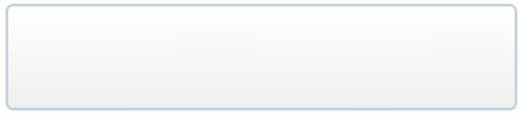

# Branding

## Table of contents
1. [Principles](#principles)
1. [What colours should I use?](#colours)
2. [What fonts should I use?](#font-type)
3. [What font sizes should I use?](#font-sizes)
4. [What font weights should I use?](#font-weights)
5. [Examples](#examples)

<a name="principles"></a>
## Principles
* We use [flat design](http://www.hongkiat.com/blog/flat-design-resources/) elements as part of our design aesthetics
* Do not use gradients

<a name="colours"></a>
## What colours should I use?

We have two brand colours. These should be used sparingly and not be used in very large blocks of colours.

### Brand Colours

Colour | Name | Hex | Used in
--- | --- | --- | ---
 | Primary | #1591fe |Icons, highlight
 | Secondary | #18304b | Main headings, navigation, icons

### Grey tones
For consistency, we try to use these greyscale values throughout our interfaces.

Colour | Name | Hex | Used in
--- | --- | --- | ---
 | Body | #010101 | Body content
 | Disclaimers | #777 | Disclaimers
 | Box 1 | #e5e5e5 | Boxes
 | Box 2 | #f5f5f5 | Boxes

### Call to Action

Colour | Name | Hex | Used in
--- | --- | --- | ---
 | Green | #27ae60 | Primary call to action buttons
 | Orange | #f17935 | Text links, hover state and  more info buttons


### Blue tones

Colour | Name | Hex | Used in
--- | --- | --- | ---
 | Light blue | e6f3ff | Backgrounds when more prominence is needed vs a grey background
 | Mid blue | #d0e9ff | Dividing lines on light blue background, froms and tooltips 
 | Dark blue | #0076cc | Links and comparison tables

### System
These are not part of our brand, but we use these in special cases.

Colour | Name | Hex | Used in
--- | --- | --- | ---
 | Red | #dd4b39 | Error messages
 | Yellow | #fc0 | Warning messages
 | Crimson | #d14 | Givig emphasis

<a name="font-type"></a>
## What fonts should I use?

We use [Proxima Nova](http://www.marksimonson.com/fonts/view/proxima-nova) for all of our text and headings.

### Alternative to Proxima Nova
``` css
body {
    font-family: proxima-nova, Helvetica, Arial, sans-serif;
}
```

<a name="font-sizes"></a>
## What font sizes should I use?

Element | Size
--- | ---
base | 15px
h1 | 2em
h2 | 1.8em
h3 | 1.6em
h4 | 1.4em
h5 | 1.2em
h6 | 1em

<a name="font-weights"></a>
## What font weights should I use?

Weight | Value
--- | ---
normal | 400
semibold | 600
bold | 600

<a name="examples"></a>
## UI Examples

### Borders

Good | Off-brand
--- | ---
  | 

```
selector {
  border: 1px solid #d8d8d8;
}
```

### Iconography

Good | Off-brand
--- | ---
 | 
 | 
 | 

### Tabs
Good | Off-brand
--- | ---
 | 

#### Active tab
``` css
.active-tab {
  background-color: #fff;
  color: #18304b;
  font-size: 14px;
  font-weight: 600;
  padding: 8px 15px;
  text-align: center;
}
```

#### Inactive tab
``` css
.inactive-tab {
  background-color: #e5e5e5;
}
```

### Tables

Good | Off-brand
--- | ---
 | 