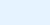
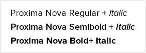
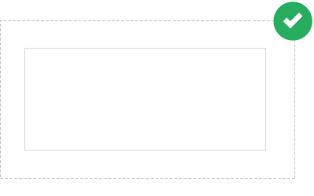
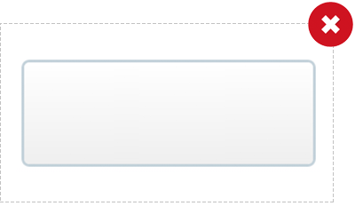
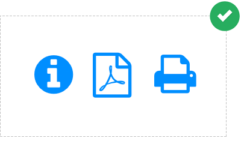
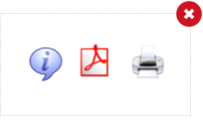
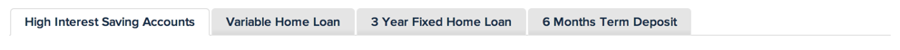
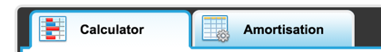
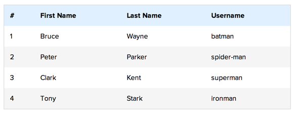
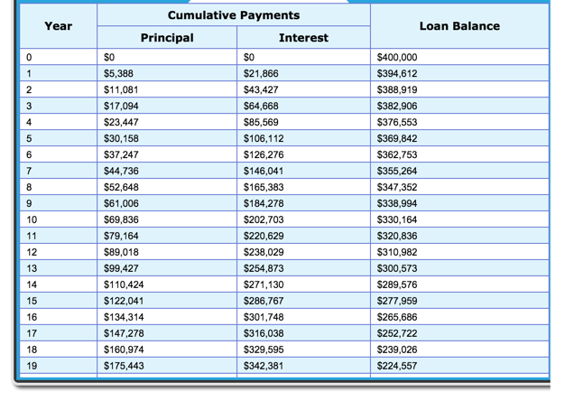

# Branding Guidelines

## Table of contents
1. [General principles](#general-principles)
2. [Colours](#colours)
3. [Typefaces](#font-type)
4. [Size of text](#font-sizes)
5. [Weight of text](#font-weights)
6. [Logo](#logo)
7. [Forms](#forms)
8. [Graphs](#graphs)
9. [Examples](#examples)

<a name="general-principles"></a>
## 1. General principles
* We use [flat design](http://www.hongkiat.com/blog/flat-design-resources/) elements as part of our design aesthetics
* Do not use gradients

<a name="colours"></a>
## 2. Colours

We have two brand colours. These should be used sparingly and not be used in very large blocks of colours.

### Brand Colours

Colour | Name | Hex | Used in
--- | --- | --- | ---
 | Primary | #1591fe |Icons, highlight
 | Secondary | #18304b | Main headings, navigation, icons

### Grey tones
For consistency, we try to use these greyscale values throughout our interfaces.

Colour | Name | Hex | Used in
--- | --- | --- | ---
 | Body | #010101 | Body content
 | Disclaimers | #777 | Disclaimers
 | Box 1 | #e5e5e5 | Boxes
 | Box 2 | #f5f5f5 | Boxes

### Call to Action

Colour | Name | Hex | Used in
--- | --- | --- | ---
 | Green | #27ae60 | Primary call to action buttons
 | Orange | #f17935 | Text links, hover state and  more info buttons


### Blue tones

Colour | Name | Hex | Used in
--- | --- | --- | ---
 | Light blue | e6f3ff | Backgrounds when more prominence is needed vs a grey background
 | Mid blue | #d0e9ff | Dividing lines on light blue background, froms and tooltips 
 | Dark blue | #0076cc | Links and comparison tables

### System
These are not part of our brand, but we use these in special cases.

Colour | Name | Hex | Used in
--- | --- | --- | ---
 | Red | #dd4b39 | Error messages
 | Yellow | #fc0 | Warning messages
 | Crimson | #d14 | Giving emphasis

<a name="font-type"></a>
## 3. Typefaces

We use [Proxima Nova](http://www.marksimonson.com/fonts/view/proxima-nova) for all of our text and headings.



### Alternative to Proxima Nova
```css
body {
    font-family: proxima-nova, Helvetica, Arial, sans-serif;
}
```

<a name="font-sizes"></a>
## 4. Text size

Element | Size
--- | ---
base | 15px
h1 | 2em
h2 | 1.8em
h3 | 1.6em
h4 | 1.4em
h5 | 1.2em
h6 | 1em

<a name="font-weights"></a>
## 5. Text weight

Weight | Value
--- | ---
normal | 400
semibold | 600
bold | 600

<a name="logo"></a>
## 6. Logo

The company logo is an important and valued graphic element and must be used
consistently and appropriately, even minor variations will undermine and compromise
the image of the branding.

TBC

<a name="forms"></a>
## 7. Forms

TBC

<a name="graphs"></a>
## 8. Graphs

TBC

<a name="examples"></a>
## 9. Examples

### Borders
 

```css
selector {
  border: 1px solid #d8d8d8;
}
```

### Iconography
 

### Tabs
Good | Off-brand
--- | ---
 | 

#### Active tab
```css
.active-tab {
  background-color: #fff;
  color: #18304b;
  font-size: 14px;
  font-weight: 600;
  padding: 8px 15px;
  text-align: center;
}
```

#### Inactive tab
```css
.inactive-tab {
  background-color: #e5e5e5;
}
```

### Tables

Good | Off-brand
--- | ---
 | 
